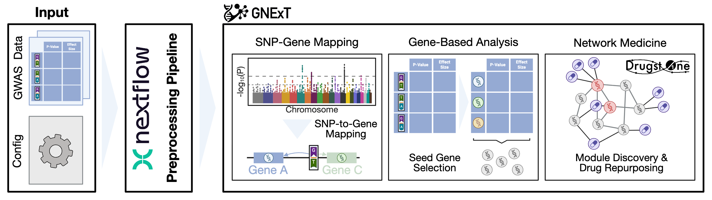
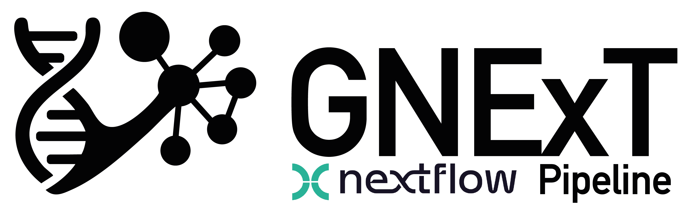

# GNExT - GWAS Network Exploration Tool

<div align="center">
  
  <p><em>GWAS Network Exploration Tool</em></p>
</div>

A web-based platform that builds on PheWeb’s interactive, scalable, and decentralized deployment model while extending its functionalities beyond a variant-level effect and significance exploration towards a systems and network medicine toolbox. 

By including MAGMA and Drugst.One, GNExT allows its users to study genetic variants on the network level down to the identification of potential drug repurposing candidates. Our solution advances over the current state of the art platform PheWeb by offering a highly standardized Nextflow pipeline for data import and processing, allowing researchers to easily deploy their study results on a web interface. 

<div align="center">
  
    <p><em>Overview of the GNExT Tool</em></p>

</div>

## Data Preprocessing - Nextflow Pipeline 

Data preprocessing for a GNExT platform is performed through a Nextflow-based pipeline that enables seamless deployment across different computing environments and automatically ensures scalability for large collections of GWAS summary statistics.

Before being able to setup a GNExT instance for your study data, please refer to GitHub repository of the preprocessing pipeline: [gnext_nf_pipeline](https://github.com/DyHealthNet/gnext_nf_pipeline).

<div align="center">
  
    <p><em>Data Preprocessing Pipeline for GNExT Platform</em></p>
</div>

## Clone Repository

While the Nextflow pipeline is running, you can already begin preparing the platform setup. First, clone this repository together with all required submodules:

```
git clone --recurse-submodules https://github.com/DyHealthNet/gnext_platform.git
```

## Platform Architecture
The platform consists of three main services:

- **🔧 [GNExT Backend](https://github.com/DyHealthNet/gnext_backend)** - Django REST API and data processing
- **🎨 [GNExT Frontend](https://github.com/DyHealthNet/gnext_frontend)** - Vue.js web interface
- 🔍 Typesense: Fast search engine for phenotypes, genes, and variants (docker image pulled automatically)

For streamlined deployment, a docker-compose stack is provided that requires only a study-specific environment file. Further details on deployment are presented below.

## Environment Setup

The platform uses a single `.env` file located at the root of `gnext_platform/` directory. This file contains all configuration variables for development and production deployments.

All services automatically read from the central `.env` file:

Key configuration variables include:

- **Study Configuration**: `STUDY_ACRONYM`, study citation details, study examples, data paths,  genome build, etc.

- **Port Configuration**: `VITE_BACKEND_PORT`, `VITE_FRONTEND_PORT`, `VITE_TYPESENSE_PORT`

- **Typesense Settings**: API keys, host configuration, volume data directory

- **UI Settings**: primary colors

> **Note**: Detailed descriptions of all environment variables are added in the .env.example file.

Fill out the .env.example file and copy it to .env:

```
cp .env.example .env
```

## Deployment for Development

1. **Backend and Typesense**
   Navigate to the backend repository: ```cd gnext_backend/```
   And then follow the instructions in the README of the [backend repository](https://github.com/DyHealthNet/gnext_backend).

2. **Frontend**
   Navigate to the frontend repository: ```cd gnext_frontend/```
   And then follow the instructions in the README of the [frontend repository](https://github.com/DyHealthNet/gnext_frontend).
3.	**Access Platform**
   Open the frontend on the port specified in the .env file, for example ```localhost:<VITE_FRONTEND_PORT>``` (e.g., ```localhost:8700```). If you are developing on a server, think about forwarding the port.

## Deployment with Docker

To start the docker compose stack, ensure you have specified everything correctly in the .env file. Then, it is only a single command to deploy the platform:

```
docker-compose up -d --build
```
In cases where the Typesense engine requires more time to initialize—for example, when indexing more than 40 million variants (default timeout: 600 seconds)—it may not become ready before the backend attempts to connect. If this occurs, wait briefly and then redeploy the backend and frontend using:

```
docker-compose up -d gnext_frontend gnext_backend
```
You can always check the currently running docker containers with: ```docker ps```

And you can check the status of the backend and check whether the backend is still waiting for typesense with:

```
docker logs gnext-backend-study
```

If you want the stop the deployment:

```
docker-compose down
```

> **Note**: Verify that the typesense docker container is not running from a development deployment, otherwise the docker compose will crash due to same naming of containers.

### Deployment of Multiple Platforms

If you need to deploy multiple platforms on the same machine, please use the following instructions, and always build with NO CACHE.

```
# Build images with correct .env file
ENV_FILE=.env.olfaction COMPOSE_PROJECT_NAME=gnext_olfaction docker-compose --env-file .env.olfaction build --no-cache
# Run containers
ENV_FILE=.env.olfaction COMPOSE_PROJECT_NAME=gnext_olfaction docker-compose --env-file .env.olfaction up -d
# If you to remove the containers again
COMPOSE_PROJECT_NAME=gnext_olfaction docker-compose --env-file .env.olfaction down
```

And then you can build similarly the second study:
```
ENV_FILE=.env.lipids COMPOSE_PROJECT_NAME=gnext_lipids docker-compose --env-file .env.lipids build --no-cache
ENV_FILE=.env.lipids COMPOSE_PROJECT_NAME=gnext_lipids docker-compose --env-file .env.lipids up -d
```

## Problems with Deployment

If you have any problems with the deployment of your platform, feel free to open a GitHub issue at any time. We are happy to help you and make GNExT applicable to any study!

## Citation

Bridging the gap between genome-wide association studies and network medicine with GNExT
Lis Arend, Fabian Woller, Bastienne Rehor, David Emmert, Johannes Frasnelli, Christian Fuchsberger, David B. Blumenthal, Markus List
bioRxiv 2026.01.30.702559; doi: https://doi.org/10.64898/2026.01.30.702559
